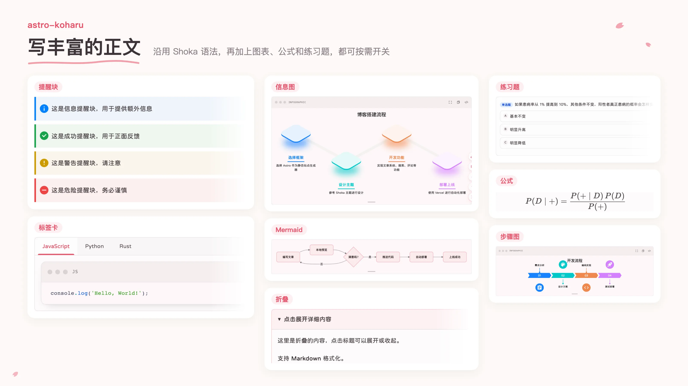
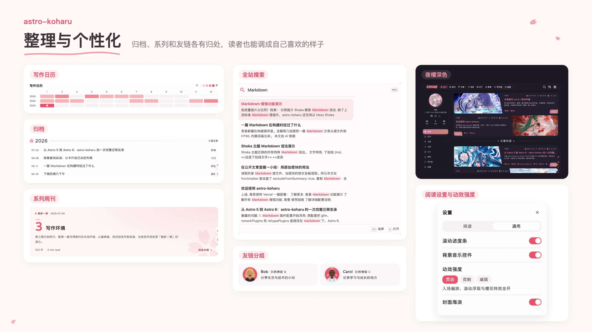

# astro-koharu

**Language:** **中文** | [English](./docs/README.en.md) | [日本語](./docs/README.ja.md)


一个萌系 / 二次元 / 粉蓝配色的博客主题，适合 ACG、前端、手账向个人站，性能优异。

> 命名灵感来源于 “小春日和”（こはるびより）指的是晚秋到初冬这段时期，持续的一段似春天般温暖的晴天。也就是中文中的"小阳春"。

博客整体设计灵感来自 Hexo 的 [Shoka](https://shoka.lostyu.me/computer-science/note/theme-shoka-doc/) 主题，用更现代的技术栈打造属于你的个人博客。

本仓库已清理为示例仓库，主题开发者的博客可查看 https://blog.cosine.ren/ 喜欢的话欢迎 star ～

[快速开始](./GETTING-STARTED.md) · [完整使用指南](./src/content/blog/tools/astro-koharu-guide.md) · [反馈与建议](https://github.com/cosZone/astro-koharu/issues)

> **许可证：AGPL-3.0。** 使用、修改和部署前请阅读 [LICENSE](./LICENSE)。

持续迭代中

- 基于 **Astro**，静态输出，加载轻快
- 萌系 / 二次元 / 粉蓝配色，适合 ACG、前端、手账向个人站
- 支持多分类、多标签，但不会强迫你用复杂信息架构
- 尽可能的减少性能开销
- 使用 pagefind 实现无后端的全站搜索
- LQIP（低质量图片占位符），图片加载前显示渐变色占位

## 页面与动效

以下动图录自本仓库的示例站点。

<table>
  <tr>
    <td width="50%"><br /><sub>封面樱花飘落，下滑后头部收成浮动胶囊</sub></td>
    <td width="50%"><br /><sub>圆形扩散，切换到夜樱深色主题</sub></td>
  </tr>
  <tr>
    <td width="50%"><br /><sub>点击导航时花瓣迸发、指示条滑动，归档、分类、友链与周刊之间平滑过渡</sub></td>
    <td width="50%"><br /><sub>丝线目录跟随阅读进度</sub></td>
  </tr>
</table>
<table>
  <tr>
    <td width="76%"><br /><sub>写作室：边写边预览</sub></td>
    <td width="24%"><br /><sub>移动端抽屉，可拖拽关闭</sub></td>
  </tr>
</table>

## 能用它做什么

| 场景 | 功能与入口 |
| --- | --- |
| 写文章 | [写作室](./docs/features/editor.md)：Markdown 源码与博客效果实时预览、可搜索的语法手册、文章属性、浏览器草稿、导入与导出；本地 CMS 复用同一编辑器保存到文件 |
| 写丰富的正文 | GFM、代码高亮、数学公式、Mermaid、Infographic、链接卡片；Shoka 提醒块、折叠、标签卡、文字特效、隐藏文字、注音、练习题和音视频，可按需开关；见[语法指南](./src/content/blog/tools/astro-koharu-guide.md#markdown-增强) |
| 标注与分享文章 | [文章落款](./src/content/blog/tools/astro-koharu-guide.md#文章落款)标注创作方式、剧透或过时提醒，支持归档筛选；[文章操作](./src/content/blog/tools/astro-koharu-guide.md#文章操作复制-markdown-与在写作室打开)可复制、下载完整 Markdown 或导入写作室 |
| 组织内容 | 多级分类、标签、归档、草稿、置顶；[特色系列](./src/content/blog/tools/astro-koharu-guide.md#系列文章系统)有独立页面与首页高亮，自定义页面可直接放在 `src/pages/` |
| 舒适阅读 | 深浅主题、移动端章节标题与目录、阅读进度和时长；Pagefind 搜索、LQIP 图片占位；`motion` 提供三档动效、樱花效果，并尊重系统减少动态效果设置 |
| 多语言发布 | 内置中文、英文、日文、韩文 UI 字典；内容翻译、语言切换、hreflang、按语言订阅 RSS；见 [i18n 配置](./src/content/blog/tools/astro-koharu-guide.md#多语言支持i18n) |
| 和读者互动 | Waline / Giscus / Remark42 / Twikoo 评论、[友链分组](./docs/features/friend-link-groups.md)、公告、Umami 统计；可配置 BGM、Bangumi 收藏与圣诞效果 |
| 生成内容资产 | [Koharu CLI](./docs/guides/koharu-cli.md)管理新建、备份、还原、更新和迁移；可生成 LQIP、语义相似度推荐与 AI 摘要 |
| 扩展博客 | 整篇或局部 AES-256-GCM 加密；可选[碎碎念](./docs/features/moments.md)接入 koharu-suite 公开频道，提供详情、搜索、分页与 RSS |






## 写作与管理

安装后，在仓库根目录创建第一篇文章：

```bash
pnpm koharu new post
```

按提示输入标题、分类和标签，文章会写入 `src/content/blog/`。也可以直接新建 Markdown 文件：

```markdown
---
title: 我的第一篇文章
date: 2026-10-09
link: hello-koharu
tags: [生活]
---

今天开始记录一点有意思的事。
```

运行 `pnpm dev` 后打开 `http://localhost:4321/post/hello-koharu`。

想在浏览器里写作，在 `config/site.yaml` 中确认 `editor.enabled: true`，重启开发服务器后打开 `http://localhost:4321/editor/`。公开写作室将草稿存在当前浏览器；需要保存到博客文件时，在另一个终端运行：

```bash
pnpm cms
```

打开 `http://localhost:4322`，在 CMS 中选择文章，进入同一个写作室编辑并保存。公开写作室与本地 CMS 的使用边界见[写作室指南](./docs/features/editor.md)。

## 本地启动

需要 **Node.js ≥ 22.20.0** 和 **pnpm 10.28.2**（以 [package.json](./package.json) 为准）。

```bash
git clone https://github.com/cosZone/astro-koharu.git
cd astro-koharu
pnpm install
pnpm dev
```

访问 `http://localhost:4321`。根目录 workspace 同时安装主站和 CMS 的依赖，共用一份 lockfile；仅安装主站可用 `pnpm --filter astro-koharu install`，仅安装 CMS 可用 `pnpm cms:install`。

接着修改 [config/site.yaml](./config/site.yaml) 中的站点名称、作者、域名、头像与导航，用自己的内容替换示例文章。配置修改后需重启开发服务器或重新构建；步骤见[快速开始](./GETTING-STARTED.md)。

## 部署

```bash
pnpm build
pnpm preview
```

| 模式 | 部署方式 | 要求 |
| --- | --- | --- |
| 静态博客（默认） | 将 `dist/` 部署到 Vercel、Netlify 或静态文件服务器；Docker 使用 nginx | 无需博客后端 |
| 碎碎念（可选） | Astro Node standalone；Docker 使用 `pnpm docker:up:dynamic` | `moments.enabled: true`、公开 `KOHARU_SUITE_URL` 与可用的 koharu-suite 服务 |

[](https://vercel.com/new/clone?repository-url=https://github.com/cosZone/astro-koharu&project-name=astro-koharu&repository-name=astro-koharu)
[](https://app.netlify.com/start/deploy?repository=https://github.com/cosZone/astro-koharu)

默认 Docker 部署：

```bash
cp .env.example .env
pnpm docker:up
```

静态与动态部署、端口、环境变量和重建方式见[部署指南](./docs/overview/11-deployment-adapters.md)。写作室可以静态托管；Vercel 自动提供链接预览抓取函数，其他静态平台需配置独立[链接预览服务](./docs/features/editor-link-service.md)才能抓取新链接卡片。

## 配置与文档

| 想调整什么 | 去哪里看 |
| --- | --- |
| 站点信息、导航、评论、音乐、动效与可选功能 | [站点配置](./config/site.yaml)与[完整使用指南](./src/content/blog/tools/astro-koharu-guide.md) |
| 分类、系列和落款的多语言文案 | [内容翻译配置](./config/i18n-content.yaml)；翻译文章放在 `src/content/blog/<locale>/` |
| 写作室、文章属性、CMS 原文保存 | [写作室指南](./docs/features/editor.md) |
| 备份、还原、更新、历史链接迁移与内容生成 | [Koharu CLI 指南](./docs/guides/koharu-cli.md) |
| 碎碎念频道与动态部署 | [碎碎念指南](./docs/features/moments.md)与[部署指南](./docs/overview/11-deployment-adapters.md) |
| 参与主题开发 | [贡献指南](./CONTRIBUTING.md) |

## 使用前了解

- **升级旧版本**：旧文章的 `slug` 需要迁移为 `link`。更新进程退出后、启动或构建前，运行 `pnpm koharu migrate --dry-run` 和 `pnpm koharu migrate`；详见 [CLI 迁移说明](./docs/guides/koharu-cli.md#历史内容迁移)。
- **写作室与 CMS**：公开写作室不会发布到仓库，浏览器草稿应下载备份；本地 CMS 用于本机文件管理。写作室当前界面与语法说明为中文，图片通过 URL 插入。
- **原文与加密**：启用文章操作时，公开 Markdown 包含 frontmatter；整篇加密或含加密块的文章不提供原文。AES-256-GCM 密码只在构建时用于加密，不传给客户端；读者需自行输入密码。
- **外部服务**：评论、音乐 API、Bangumi、Umami 和链接抓取依赖各自服务；AI 摘要、语义向量是可选生成步骤。
- **性能**：下方截图是历史示例，效果会受内容、配置与部署影响。请对自己的站点重新测量。

## 界面预览

以下保留原有演示图，部分截图早于当前版本。


[性能优异](https://pagespeed.web.dev/analysis/https-blog-cosine-ren/w6qzrwbp9b?hl=zh-cn&form_factor=desktop)：目标是 PC 的全绿，但是随着功能迭代不可避免的需要反复检查！


欢迎在 [issue 区域](https://github.com/cosZone/astro-koharu/issues)提 issue，不过这毕竟是个人项目，喜欢的也欢迎 fork 出去改。


## 特色功能演示图片

- 图片加载前显示渐变色占位，提升视觉体验 - [介绍文章](https://blog.cosine.ren/post/astro-lqip-implementation)
  
- 使用 view-transition 实现的流畅的深色模式切换主题过渡动画。
  
- Markdown 增强 - 链接嵌入功能 - [示例](https://blog.cosine.ren/post/my-claude-code-record-2)
  
- Markdown 增强 - 使用 [@antv/infographic](https://github.com/antvis/Infographic) 创建各种精美的信息图表。
  [Infographic 信息图指南](https://koharu.cosine.ren/post/infographic-guide)
  
- 有样式的 RSS 订阅源链接 - [示例](https://blog.cosine.ren/rss.xml)
  
- 公告系统
  
- Shoka 兼容 Markdown 语法 - 提醒块、折叠块、标签卡、文字特效、隐藏文字、注音标注、练习题等
- 音视频播放器 - 支持音乐歌单和视频播放，通过 [Meting](https://github.com/metowolf/meting) API 解析，推荐自部署

## 使用本主题的博客

> 学习[纸鹿的博客](https://github.com/L33Z22L11/blog-v3)，我也弄一个放谁在用我的主题的区域。\
> 欢迎加入 Q 群 598022684 进行讨论，或者在我的[前端频道](https://t.me/cosine_front_end)的评论区群聊讨论。

| 博客名称                                  | 作者       | 仓库                                                            | 特色功能 or 备注             |
| ----------------------------------------- | ---------- | --------------------------------------------------------------- | ---------------------------- |
| **[余弦の博客](http://blog.cosine.ren/)** | **cosine** | [cosZone/astro-koharu](https://github.com/cosZone/astro-koharu) | 本主题                       |
| [雪花的博客](https://xhblog.top/)         | XueHua-s   | [XueHua-s/astro-snow](https://github.com/XueHua-s/astro-snow)   | 精简了很多功能，增加了起始页 |
| [Ksable's 小屋](https://blog.ksable.top/) | Ksable    | [God-2077/astro-blog](https://github.com/God-2077/astro-blog) | 修改 / 新增了部分功能 |

## 🙏 鸣谢

使用字体[寒蝉全圆体](https://chinese-font.netlify.app/zh-cn/fonts/hcqyt/ChillRoundFRegular)

感谢以下项目对 astro-koharu 的开发提供的灵感及参考：

- [mx-space](https://github.com/mx-space)
- [Hexo 主题 Shoka](https://shoka.lostyu.me/computer-science/note/theme-shoka-doc/)
- [waterwater.moe](https://github.com/lawvs/lawvs.github.io)
- [yfi.moe](https://github.com/yy4382/yfi.moe)
- [4ark.me](https://github.com/gd4Ark/gd4Ark.github.io)
- [纸鹿摸鱼处](https://blog.zhilu.site/)

## Star History

[](https://www.star-history.com/#cosZone/astro-koharu&type=date&legend=top-left)

## License

[GNU Affero General Public License version 3 (AGPL-3.0)](./LICENSE)
