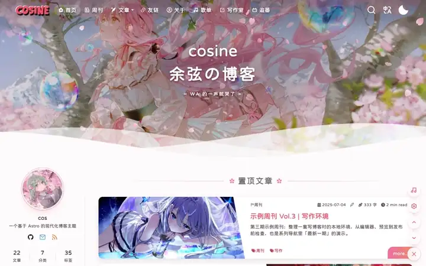
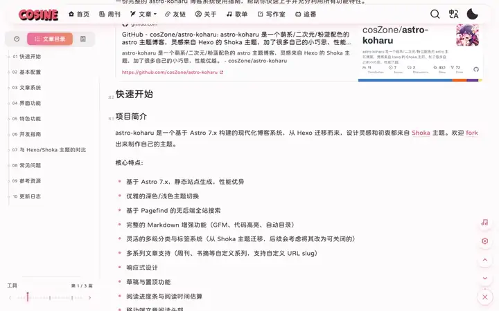
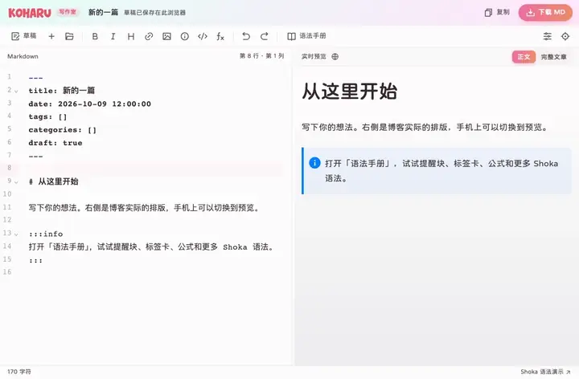
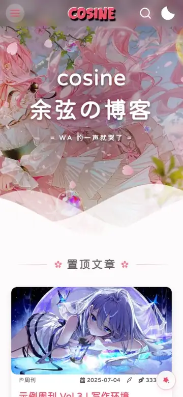

# astro-koharu

**Language:** [中文](../README.md) | [English](./README.en.md) | **日本語**


かわいい / アニメ風 / ピンクブルー配色のブログテーマ。ACG、フロントエンド、手帳系の個人サイトに最適で、優れたパフォーマンスを実現します。

> 名前は「小春日和（こはるびより）」に由来しています。晩秋から初冬にかけての、春のように暖かく晴れた日が続く時期のことです。

デザインは Hexo の [Shoka](https://shoka.lostyu.me/computer-science/note/theme-shoka-doc/) テーマにインスピレーションを受け、モダンな技術スタックであなただけのブログを構築します。

このリポジトリはデモ用に整理されています。テーマ開発者のブログは https://blog.cosine.ren/ をご覧ください。気に入ったらスターをお願いします！

[クイックスタート](../GETTING-STARTED.md) · [使い方ガイド](../src/content/blog/tools/astro-koharu-guide.md) · [フィードバック](https://github.com/cosZone/astro-koharu/issues)

> **ライセンス：AGPL-3.0。** 利用・改変・デプロイの前に [LICENSE](../LICENSE) を確認してください。

開発継続中

- **Astro** ベース、静的出力、高速ロード
- かわいい / アニメ風 / ピンクブルー配色、ACG・フロントエンド・手帳系サイトに最適
- マルチカテゴリー・マルチタグ対応、複雑な情報構造を強制しない
- パフォーマンスオーバーヘッドを最小限に
- Pagefind によるサーバーレス全文検索
- LQIP（低品質画像プレースホルダー）— 画像読み込み前にグラデーションプレースホルダーを表示

## 画面と動き

このリポジトリのデモサイト（中国語 UI）で録画しています。

<table>
  <tr>
    <td width="50%"><br /><sub>カバーに桜が舞い、スクロールするとヘッダーがカプセル型に浮かぶ</sub></td>
    <td width="50%"><br /><sub>円形に広がって夜桜のダークテーマへ切り替え</sub></td>
  </tr>
  <tr>
    <td width="50%"><br /><sub>クリックで花びらが弾け、ナビのハイライトが滑り、アーカイブ・カテゴリー・友達リンク・連載を滑らかに遷移</sub></td>
    <td width="50%"><br /><sub>糸のような目次が読み進める位置を追う</sub></td>
  </tr>
</table>
<table>
  <tr>
    <td width="76%"><br /><sub>書きながらプレビューできる執筆ルーム</sub></td>
    <td width="24%"><br /><sub>ドラッグで閉じられるモバイルドロワー</sub></td>
  </tr>
</table>

## できること

| 用途 | 機能とガイド |
| --- | --- |
| 記事を書く | [執筆ルーム](./features/editor.md)：Markdown とブログ表示のライブプレビュー、検索できる構文ガイド、記事プロパティ、ブラウザ下書き、インポート・エクスポート。ローカル CMS も同じエディターでファイルに保存 |
| 表現豊かな本文を書く | GFM、コードハイライト、数式、Mermaid、Infographic、リンクカード。Shoka の注意書き、折りたたみ、タブ、文字装飾、ネタバレ隠し、ルビ、クイズ、音声・動画を個別に切り替え可能。[構文ガイド](../src/content/blog/tools/astro-koharu-guide.md#markdown-增强)を参照 |
| 記事に印を付けて共有する | [落款](../src/content/blog/tools/astro-koharu-guide.md#文章落款)で執筆方法・ネタバレ・古い情報を表示し、アーカイブで絞り込み。[記事操作](../src/content/blog/tools/astro-koharu-guide.md#文章操作复制-markdown-与在写作室打开)で Markdown 全文をコピー・ダウンロード・執筆ルームへ取り込み |
| 内容を整理する | 階層カテゴリ、タグ、アーカイブ、下書き、固定記事。[シリーズ](../src/content/blog/tools/astro-koharu-guide.md#系列文章系统)には専用ページとホームのハイライトがあり、独立ページは `src/pages/` に追加 |
| 快適に読む | ライト・ダークテーマ、モバイルの章タイトルと目次、読書進捗と所要時間。Pagefind 検索、LQIP 画像プレースホルダー。`motion` は 3 段階の動きと桜の演出を設定でき、OS の動きを減らす設定に対応 |
| 多言語で公開する | 中国語・英語・日本語・韓国語の UI 辞書、記事翻訳、言語切り替え、hreflang、言語別 RSS。[i18n 設定](../src/content/blog/tools/astro-koharu-guide.md#多语言支持i18n)を参照 |
| 読者と交流する | Waline / Giscus / Remark42 / Twikoo コメント、[リンク集のグループ](./features/friend-link-groups.md)、お知らせ、Umami。BGM、Bangumi コレクション、クリスマス演出も設定可能 |
| コンテンツ用データを生成する | [Koharu CLI](./guides/koharu-cli.md)で新規作成・バックアップ・復元・更新・移行。LQIP、意味的類似度による関連記事、AI 要約も任意で生成 |
| ブログを拡張する | 記事全体・ブロック単位の AES-256-GCM 暗号化。任意の[ひとこと（Moments）](./features/moments.ja.md)で koharu-suite の公開チャンネルを取り込み、詳細・検索・ページ送り・RSS を提供 |

<!-- 新機能の紹介画像用：design/readme-visual-brief.md を参照。新しい画像はリポジトリに保存し、既存のスクリーンショットは維持。 -->

## 記事の作成と管理

インストール後、リポジトリのルートで最初の記事を作成します。

```bash
pnpm koharu new post
```

タイトル・カテゴリ・タグを入力すると `src/content/blog/` にファイルが作られます。Markdown ファイルを直接作成することもできます。

```markdown
---
title: はじめての記事
date: 2026-10-09
link: hello-koharu
tags: [日常]
---

覚えておきたいことを、今日から少しずつ。
```

`pnpm dev` を起動して `http://localhost:4321/post/hello-koharu` を開きます。

ブラウザで執筆する場合は `config/site.yaml` の `editor.enabled: true` を確認し、開発サーバーを再起動して `http://localhost:4321/editor/` を開いてください。公開の執筆ルームは現在のブラウザに下書きを保存します。ブログのファイルへ保存したい場合は、別のターミナルで次を実行します。

```bash
pnpm cms
```

`http://localhost:4322` の CMS で記事を選び、同じ執筆ルームで編集・保存します。公開エディターとローカル CMS の使い分けは[執筆ルームガイド](./features/editor.md)を参照してください。

## ローカルで起動

**Node.js ≥ 22.20.0** と **pnpm 10.28.2** が必要です。要件は [package.json](../package.json) に従います。

```bash
git clone https://github.com/cosZone/astro-koharu.git
cd astro-koharu
pnpm install
pnpm dev
```

`http://localhost:4321` を開きます。ルートの workspace は共通の lockfile でブログと CMS の依存関係をインストールします。ブログのみなら `pnpm --filter astro-koharu install`、CMS のみなら `pnpm cms:install` を使えます。

[config/site.yaml](../config/site.yaml) でサイト名・作者・ドメイン・アバター・ナビゲーションを変更し、サンプル記事を自分の記事に置き換えてください。設定変更後は開発サーバーの再起動または再ビルドが必要です。手順は[クイックスタート](../GETTING-STARTED.md)を参照してください。

## デプロイ

```bash
pnpm build
pnpm preview
```

| モード | デプロイ方法 | 必要なもの |
| --- | --- | --- |
| 静的ブログ（標準） | `dist/` を Vercel、Netlify、静的ファイルサーバーで公開。Docker は nginx を使用 | ブログ用バックエンドは不要 |
| ひとこと（任意） | Astro Node standalone。Docker は `pnpm docker:up:dynamic` を使用 | `moments.enabled: true`、公開 `KOHARU_SUITE_URL`、稼働中の koharu-suite サービス |

[](https://vercel.com/new/clone?repository-url=https://github.com/cosZone/astro-koharu&project-name=astro-koharu&repository-name=astro-koharu)
[](https://app.netlify.com/start/deploy?repository=https://github.com/cosZone/astro-koharu)

標準の Docker デプロイ：

```bash
cp .env.example .env
pnpm docker:up
```

モード・ポート・環境変数・再ビルドは[デプロイガイド](./overview/11-deployment-adapters.md)を参照してください。執筆ルームは静的ホスティングが可能です。Vercel はリンクプレビュー用の取得関数を含みます。それ以外の静的ホストで新しいリンクカードを取得するには、別途[リンクプレビューサービス](./features/editor-link-service.md)を設定します。

## 設定とドキュメント

| 設定したいこと | 参照先 |
| --- | --- |
| サイト情報・ナビゲーション・コメント・音楽・動き・任意機能 | [サイト設定](../config/site.yaml)と[使い方ガイド](../src/content/blog/tools/astro-koharu-guide.md) |
| カテゴリ・シリーズ・落款の翻訳 | [コンテンツ翻訳](../config/i18n-content.yaml)。翻訳記事は `src/content/blog/<locale>/` に配置 |
| 執筆ルーム・記事プロパティ・CMS の原文保存 | [執筆ルームガイド](./features/editor.md) |
| バックアップ・復元・更新・旧リンクの移行・データ生成 | [Koharu CLI ガイド](./guides/koharu-cli.md) |
| ひとことのチャンネル・動的デプロイ | [ひとことガイド](./features/moments.ja.md)と[デプロイガイド](./overview/11-deployment-adapters.md) |
| テーマ開発への参加 | [コントリビューションガイド](../CONTRIBUTING.md) |

設定・開発ガイドの多くは現在中国語です。ひとことには英語・日本語のガイドもあります。

## 利用前に知っておくこと

- **旧記事の移行**：旧 `slug` は `link` へ移行が必要です。更新プロセスの終了後、起動・ビルド前に `pnpm koharu migrate --dry-run` と `pnpm koharu migrate` を実行します。[移行手順](./guides/koharu-cli.md#历史内容迁移)を参照してください。
- **執筆ルームと CMS**：公開エディターはリポジトリへ公開しません。下書きはダウンロードして保管し、ファイル管理にはローカル CMS を使います。執筆ルームの UI と構文ガイドは現在中国語で、画像は URL で挿入します。
- **原文と暗号化**：記事操作を有効にすると frontmatter を含む Markdown 原文が公開されます。暗号化記事・暗号化ブロックを含む記事の原文は公開しません。AES-256-GCM のパスワードはビルド時の暗号化に使用し、クライアントへ配布せず、読者が入力します。
- **外部サービス**：コメント、音楽 API、Bangumi、Umami、リンク取得は各サービスに依存します。AI 要約と意味ベクトルは任意の生成処理です。
- **パフォーマンス**：以下の画像は過去の例です。結果は記事・設定・ホスティングによって変わるため、自分のサイトで計測してください。

## 画面プレビュー

既存のデモ画像を掲載しています。一部は現在のバージョンより前のものです。


[優れたパフォーマンス](https://pagespeed.web.dev/analysis/https-blog-cosine-ren/w6qzrwbp9b?hl=ja&form_factor=desktop)：デスクトップでオールグリーンを目指していますが、機能追加に伴い継続的なチェックが必要です！


[Issue](https://github.com/cosZone/astro-koharu/issues) も歓迎しますが、個人プロジェクトですので、フォークしてカスタマイズも自由にどうぞ！


## 機能ショーケース

- 画像読み込み前のグラデーションプレースホルダーで視覚体験を向上 - [ブログ記事](https://blog.cosine.ren/post/astro-lqip-implementation)
  
- View Transitions API によるスムーズなダークモード切り替えアニメーション
  
- Markdown 拡張 - リンク埋め込み機能 - [サンプル](https://blog.cosine.ren/post/my-claude-code-record-2)
  
- Markdown 拡張 - [@antv/infographic](https://github.com/antvis/Infographic) で美しいインフォグラフィックを作成
  [インフォグラフィックガイド](https://koharu.cosine.ren/post/infographic-guide)
  
- スタイル付き RSS フィードページ - [サンプル](https://blog.cosine.ren/rss.xml)
  
- お知らせシステム
  
- Shoka 互換 Markdown 構文 - 注意ブロック、折りたたみブロック、タブカード、テキストエフェクト、スポイラーテキスト、ルビ注釈、クイズなど
- オーディオ/ビデオプレーヤー - 音楽プレイリストと動画再生に対応。[Meting](https://github.com/metowolf/meting) API を利用でき、セルフホストを推奨

## このテーマを使用しているブログ

> [Zhilu のブログ](https://github.com/L33Z22L11/blog-v3)にならって、このテーマを使用しているブログのショーケースを設けました。\
> QQ グループ 598022684 でのディスカッションや、[フロントエンドチャンネル](https://t.me/cosine_front_end)のコメント欄でのチャットにぜひご参加ください。

| ブログ                                         | 作者       | リポジトリ                                                      | 備考                                   |
| ---------------------------------------------- | ---------- | --------------------------------------------------------------- | -------------------------------------- |
| **[Cosine のブログ](http://blog.cosine.ren/)** | **cosine** | [cosZone/astro-koharu](https://github.com/cosZone/astro-koharu) | このテーマ                              |
| [XueHua のブログ](https://xhblog.top/)         | XueHua-s   | [XueHua-s/astro-snow](https://github.com/XueHua-s/astro-snow)   | 機能を簡素化、スタートページを追加      |
| [Ksable's 小屋](https://blog.ksable.top/)      | Ksable     | [God-2077/astro-blog](https://github.com/God-2077/astro-blog)  | 一部機能を変更 / 追加                  |

## 謝辞

使用フォント：[Chill Round](https://chinese-font.netlify.app/zh-cn/fonts/hcqyt/ChillRoundFRegular)

astro-koharu の開発にインスピレーションとリファレンスを提供してくれた以下のプロジェクトに感謝します：

- [mx-space](https://github.com/mx-space)
- [Hexo テーマ Shoka](https://shoka.lostyu.me/computer-science/note/theme-shoka-doc/)
- [waterwater.moe](https://github.com/lawvs/lawvs.github.io)
- [yfi.moe](https://github.com/yy4382/yfi.moe)
- [4ark.me](https://github.com/gd4Ark/gd4Ark.github.io)
- [Zhilu のブログ](https://blog.zhilu.site/)

## Star History

[](https://www.star-history.com/#cosZone/astro-koharu&type=date&legend=top-left)

## License

[GNU Affero General Public License version 3 (AGPL-3.0)](../LICENSE)
