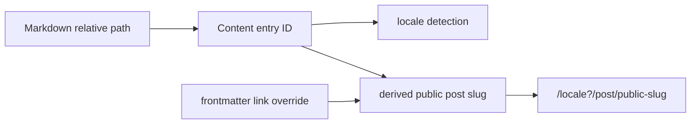

# Astro 6 迁移设计文档

> 作者：Codex（与维护者协作） ｜ 日期：2026-07-20 ｜ 状态：Implemented

## 1. 背景与问题（Context）

Astro 6 于 2026-03-10 发布，核心迁移约束包括 Node.js 22.12+、Vite 7、Zod 4、Shiki 4，以及基于 Vite
Environment API 重构的开发与构建管线。当前项目使用 Astro 5.16.6、`@astrojs/react` 4.4.2 和 Shiki 3.22.0；
Vite 已是 7.3.1（`package.json:38-40,63,144,150`）。

不能直接照发布博客运行无版本限制的 `pnpm dlx @astrojs/upgrade`：截至 2026-07-20，npm 的 `astro@latest` 已是
7.1.1，而最新 6.x 是 6.4.8。本次应显式约束 Astro 6 major，并逐项升级官方及第三方 integrations。

项目不是单纯的 Astro 页面集合：它有一套依赖内容路径的多语言身份模型。当前 Content Collections 仍通过旧入口
`src/content/config.ts` 定义，且从 `astro:content` 导入 Zod（`src/content/config.ts:1`）；业务代码通过 legacy
`post.slug` 判断语言和生成公开路径（`src/lib/content/locale.ts:19-65`），文章页还调用 legacy `post.render()`
（`src/pages/post/[...slug].astro:32-52`）。Astro 6 会移除这套自动兼容行为，因此内容层迁移是本项目的主路径。

基线环境为 Node.js 25.6.0 / pnpm 10.28.2。迁移前：

- `pnpm check`：347 个文件，0 error / warning / hint。
- `pnpm build`：成功生成 130 个页面，Pagefind 索引 134 个页面，总耗时约 21.62 秒。
- 基线已有 Shiki `infographic` 回退日志、外部链接抓取 403，以及大于 500 kB chunk 警告；这些不是 Astro 6 回归。
- Astro 5 preview 下 `/rss.xml` 与 `/rss.xml/` 均返回 200；Astro 6 明确只允许无尾斜杠的文件扩展名 endpoint。
- Astro 5 preview 下 `/zh/` 与 `/zh/post/*` 已返回 404，因此当前注释所称的默认语言前缀重定向并未生效。

## 2. 目标与非目标（Goals / Non-Goals）

### Goals

1. 升级到最新 Astro 6.x，并保证依赖范围不会意外跨入 Astro 7。
2. 完整迁移到 Content Layer API，不启用 `legacy.collectionsBackwardsCompat`。
3. 保持现有公开文章 URL、`link` override、多语言 fallback、canonical 与 hreflang 语义不变。
4. 保持 Markdown/Shoka、代码块、Mermaid、infographic、加密内容、搜索、RSS、sitemap 与 robots 功能可用。
5. 在 Node.js 22.12+ 约束下通过 `pnpm lint`、`pnpm check`、`pnpm build` 和 `git diff --check`，并完成重点页面冒烟。
6. 迁移完成且结果稳定后，按仓库博客规范写一篇基于真实 diff、故障与验证结果的中文技术博客。

### Non-Goals

- 不在同一变更中启用 Fonts API、CSP、Live Content Collections、Rust compiler、queued rendering 或 route caching。
- 不改静态输出 + nginx 的部署架构，也不引入 SSR adapter。
- 不借机重写 i18n、CMS、Markdown 管线或前端组件架构。
- 不把既有大 chunk、外部链接 403 或 infographic fallback 日志扩展成独立性能/稳定性项目。
- 不默认把根项目和独立 `cms/` 的所有 Zod 用法一起升级到 Zod 4；内容 schema 使用 `astro/zod` 隔离迁移，其他用法只在
  出现实际兼容问题时处理。

## 3. 约束与假设（Constraints & Assumptions）

- 站点以静态模式构建，Docker builder 使用 `node:22-alpine`（`docker/Dockerfile:11-27`）；应在 `package.json` 增加
  `engines.node >=22.12.0`，使本地、CI 和托管平台约束显式化。
- 项目没有自动化测试脚本；仓库要求以 lint、Astro/TypeScript check、build 和人工路由验证作为提交门槛。
- `astro.config.mjs` 包含 8 个 integrations、5 个 Vite plugins/配置接缝，以及顺序敏感的 Remark/Rehype/Shiki 管线
  （`astro.config.mjs:95-172,175-255`）。不能仅依赖类型检查判断迁移成功。
- 当前直接使用 `ClientRouter`，未使用已删除的 `<ViewTransitions />`（`src/layouts/Layout.astro:15,109`）。
- `getStaticPaths()` 的 params 均为字符串；没有 `Astro.glob()`、CommonJS Astro config、adapter API 或客户端
  `getImage()` 用法。
- 项目未使用 `astro:assets` 的 `<Image />` / `<Picture />` / `getImage()`，Astro 6 图片裁剪、禁止放大和 SVG
  rasterization 变化不构成直接代码迁移项，但仍需抽查 Markdown 图片渲染。
- `redirectToDefaultLocale: true` 与 `prefixDefaultLocale: false` 的组合在 Astro 6 不再允许
  （`astro.config.mjs:241-248`）。因为基线 `/zh/*` 已是 404，推荐移除无效选项并修正误导注释，而不是新增重定向系统。

## 4. 方案设计（Detailed Design）

### 4.1 版本与运行时边界

显式升级到 Astro 6 支持线，并只同步必要依赖：

| 包 | 当前 | 目标/策略 | 原因 |
|---|---:|---:|---|
| `astro` | 5.16.6 | `^6.4.8` | 锁定最新 6.x，不跟随 `latest` 进入 7.x |
| `@astrojs/react` | 4.4.2 | `^5.0.7` | Astro 6 / Vite Environment API 对应 major |
| `@astrojs/sitemap` | 3.7.0 | `^3.7.3` | 同步官方 patch 并复验产物 |
| `@astrojs/check` | 0.9.6 | `^0.9.9` | 使用当前 Astro 检查器 |
| `shiki` | 3.22.0 | `^4.3.1` | Astro 6 Markdown 高亮使用 Shiki 4 |
| `astro-mermaid` | 1.2.0 | `^2.1.0` | 当前 peer range 只到 Astro 5；2.1 支持 Astro 6 |
| `astro-pagefind` | 1.8.5 | `^1.8.6` | 1.8.6 已支持 Astro 6 且保留现有搜索 UI；2.x 会要求重写交互层 |
| `@yeskunall/astro-umami` | 0.0.4 | `0.0.9` | 当前 peer range 只到 Astro 5；0.0.9 支持 Astro 6 |
| `astro-loading-indicator` | 0.7.1 | `^0.9.0` | 新版显式支持 Astro 6，需验证 ClientRouter 行为 |
| `sonda` | 0.10.1 | `^0.14.0` | 更新构建 hook 兼容性；仅在 `ANALYZE=true` 时启用 |
| `@astrojs/rss` | `^4.0.14`（直接依赖） | `^4.0.19`（继续直接依赖） | 4.0.14 调用了 Zod 4 已移除的 `.returns()`；4.0.19 兼容 Zod 4 |
| `@astrojs/markdown-remark` | 间接依赖 | `7.2.0`（直接） | 通过显式 `unified()` processor 保留完整 Markdown 插件链并消除弃用警告 |

`astro-icon`、`astro-robots-txt`、`astro-seo`、`astro-tooltips` 先保持版本，通过实际 Astro 6 build 和功能冒烟决定
是否需要替换或补丁升级。`astro-mermaid` 的 ELK peer 是 optional，当前配置也明确跳过 ELK，不新增该依赖。

### 4.2 Content Layer 迁移

把配置移动为 `src/content.config.ts`，使用 Astro 6 的标准入口：

```ts
import { defineCollection } from 'astro:content';
import { glob } from 'astro/loaders';
import { z } from 'astro/zod';

const blogCollection = defineCollection({
  loader: glob({ pattern: '**/[^_]*.{md,mdx}', base: './src/content/blog' }),
  schema: blogSchema,
});
```

日期 transform 继续保持“把 gray-matter 的无时区 Date 按站点时区重解释”的既有契约。Zod 4 下将旧的
`z.ZodType<Output, z.ZodTypeDef, Input>` 调整为 Zod 4 的 `z.ZodType<Output, Input>`，不改变 schema 输出字段。
`.default(true)` 的输出默认值仍为 boolean，不涉及官方提示的 transform + default 类型变化。

内容身份分为内部 entry ID、公开 post slug 和 frontmatter link override 三层：



- 只把 `BlogPost` 上的 legacy `post.slug` 改为 `post.id`。
- `PostRef.slug`、生成脚本里的 `ScannedPost.slug` 等已表示公开路径的 DTO 字段继续保留；禁止全仓机械替换。
- `post.render()` 改为 `render(post)`，其余 `body` / `data` 读取保持不变。
- `getPostSlug()` 仍执行 `data.link ?? transliterate(localeFree(content entry ID))`，确保公开 URL 与迁移前一致。
- `getPostById()` 继续用内部 ID 查找；路由 props 传递同一 entry ID，不把公开 slug 当内部主键。

#### 4.2.1 用户内容与历史备份迁移

下游仓库的文章集合、旧 frontmatter 和备份时间点各不相同，不能要求用户手工批量改文章。Koharu CLI 新增
`pnpm koharu migrate`，并支持 `--dry-run`：

- 已有 `link` 保持不变；同时存在历史 `slug` 时仅移除 `slug`，因为旧运行时本就以 `link` 为公开 URL；
- 只有 `slug` 时原位改名为 `link`，保留精确公开 URL；两者都没有时按去除 locale 前缀的旧文件路径补 `link`；
- 先扫描全量文章与同语言链接冲突，任何解析错误或重复链接都会阻止全部写入；迁移可重复执行；
- 正式执行前自动创建基础备份；Koharu 恢复旧备份后自动运行同一迁移；新备份 manifest 增加 `schemaVersion: 2`，
  缺少该字段的历史备份仍按 v1 恢复；
- 恢复博客内容和用户图片时按快照替换目录，避免新版示例文章与旧备份混合；独立 Markdown 页面仅替换同类文件，
  配置目录继续合并以保留新版新增配置文件；
- 基础备份不包含 summaries、similarities 与 LQIP，恢复后给出重新生成提示；完整备份继续恢复与该内容快照配套的生成资产。

用真实下游仓库做只读 dry-run：376 篇文章中 375 篇已有 `link`，仅 1 篇需要按路径补齐，未发现重复链接；说明迁移可以
保持为小范围、幂等的 metadata 修复，不需要重写正文或重新格式化 frontmatter。

### 4.3 配置与 integration 适配

1. 删除不再合法且基线无效的 `redirectToDefaultLocale: true`，保留 `prefixDefaultLocale: false`，同步修正
   `src/i18n/utils.ts:76-79` 的注释。
2. Shiki 4 下重新类型检查两个自定义 `ShikiTransformer`，并用现有长代码块、`title/url/mark/command` meta fixture
   验证生成的 `data-*` 与 collapsible wrapper。
3. 对 Mermaid、Pagefind、Umami、loading indicator、sitemap、robots 和 Sonda 逐项验证。peer range 通过不等于运行时正确。
4. 检查 `<script>` / `<style>` 顺序变化。重点是 `Layout.astro` 的 ClientRouter、loading indicator、tooltips、主题初始化与
   页面增强脚本，防止首次加载或客户端导航顺序回归。
5. 保留 `vite.build.sourcemap`、自定义 virtual snowfall plugin、YAML/SVGR/Tailwind plugins。由于 Astro 6 的预渲染走
   Vite Environment API，`react-tweet` 必须从 `vite.ssr.noExternal` 移到 `vite.resolve.noExternal`，才能正确处理其 CSS import。

### 4.4 兼容性不变式

- 默认语言 URL 无前缀，`en` / `ja` 保持前缀。
- `link` frontmatter 的公开 URL 优先级不变。
- 未翻译文章的 locale fallback 与 canonical 指向不变。
- 构建后的文章、分类、标签、series、RSS、sitemap、robots 路由集合不减少。
- `/rss.xml`、`/en/rss.xml`、`/ja/rss.xml` 继续可用；`/rss.xml/` 按 Astro 6 规范允许从 200 变为 404。
- 标题 ID、TOC href、代码块 wrapper/data attributes、Mermaid 容器和加密内容 DOM 在抽样页面中保持等价。

### 4.5 Astro 6 可选能力评估

| 能力 | 表面接入成本 | 本项目真实代价 | 建议 |
|---|---:|---|---|
| redesigned `astro dev` | 无 | Astro 6 默认生效，只需验证 integrations | ✅ 直接获得，不增加范围 |
| Fonts API | 低到中 | 现有约 20 MB 中日文字体分片、按 locale 加载、WenKai 懒加载和自定义 reader font 设置需要重新建模 | ⏭ 单独做字体性能项目 |
| `security.csp` | 看似低 | 官方明确暂不支持 `ClientRouter` 和 Shiki；项目还有 inline scripts/styles、CodePen、评论和分析等外部资源 | ❌ 本轮不启用 |
| Live Content Collections | 高 | 需要 adapter 和按需渲染，与 Markdown + static nginx 的发布模型不匹配 | ❌ 不适用 |
| route caching | 高 | 只服务 on-demand rendering；预渲染页面不会使用 | ❌ 不适用 |
| Rust compiler | 配置低 | 需新增 compiler package；仍是 experimental，可能在 patch 版本发生变化 | 🧪 迁移后仅做本地 benchmark |
| queued rendering | 配置低 | 仍是 experimental；当前 130-page build 的主要耗时还包括 Vite/client bundling，收益未知 | 🧪 迁移后仅做本地 benchmark |

因此，本轮值得启用的只有 Astro 6 默认带来的新版 dev/build pipeline。两个 experimental 选项可以作为迁移后的附加实验：分别
执行一次隔离构建、记录耗时和产物差异，但不写入最终生产配置。Fonts API 是唯一值得单独立项的稳定能力，不过它不是本次迁移的
低成本附赠项。

## 5. 备选方案与权衡（Alternatives Considered）

| 方案 | 优点 | 代价 / 风险 | 是否采用 |
|---|---|---|---|
| A. 一次完成 clean migration | 不背负 legacy flag；能真正验证 Astro 6；后续升 7 更简单 | 同一变更涉及内容 API、integrations 和依赖，验证量较大 | ✅ 推荐 |
| B. 先开 `collectionsBackwardsCompat`，后迁内容层 | 首次版本升级 diff 小，短期恢复构建快 | 把主要风险推迟；保留已进入 maintenance mode 的语义；需要二次迁移和二次回归 | ❌ 仅作为紧急排障手段 |
| C. 只升级 `astro` 并忽略 peer warning | 改动最少 | 三个 integrations 明确只声明支持到 Astro 5；内容配置和 `post.render()` 仍是 legacy API | ❌ 不满足成功标准 |
| D. 升级同时采用 Astro 6 新功能 | 可一次引入 Fonts/CSP 等能力 | 无法区分兼容迁移与功能变化，回滚和故障定位成本显著增加 | ❌ 建议拆分后续变更 |

若存在必须当天上线、无法一次完成内容层迁移的外部期限，推荐可临时从 A 改为 B；当前没有此约束。

## 6. 横切关注点（Cross-cutting Concerns）

- **安全/隐私**：不在本次启用 CSP，以免第三方评论、分析、字体和嵌入资源同时受影响；Umami 配置不得输出 secret。
- **性能**：记录基线页面数、Pagefind 索引数、构建耗时和最大 chunks，但依赖升级导致 hash 变化不视为回归。既有大 chunk
  警告单独处理。
- **可观测性**：保留完整 check/build 日志，将“基线已有 warning”和“新增 warning/error”分开报告。
- **错误与降级**：某个第三方 integration 阻塞构建时，先验证其新版/配置；只有可选 integration 才允许临时禁用，并必须在
  交付说明中列出用户可见影响。
- **成本**：静态构建架构不变，不引入运行时服务或新的部署费用。

## 7. 影响面与风险（Impact & Risks）

| 风险 | 证据/触发面 | 缓解 |
|---|---|---|
| 内容 ID 与公开 slug 混淆 | `post.slug`、`PostRef.slug`、生成脚本 slug 同名不同义 | 先建立词汇表，只替换 `BlogPost` 字段，做路由集合对比 |
| Zod 4 schema 类型不兼容 | 旧代码依赖 `ZodTypeDef` 三泛型 | 使用 `astro/zod` 和 Zod 4 两泛型，check + 内容 sync 验证全部 frontmatter |
| Shiki 4 transformer 输出变化 | 两个自定义 transformers 直接使用 Shiki AST/context | 类型检查并对代表性代码块做 HTML 断言/人工检查 |
| 第三方 integration 使用旧 hooks | 3 个包的当前 peer range 只到 Astro 5 | 升级到声明支持 Astro 6 的版本，逐项启用定位失败 |
| 客户端导航/脚本顺序变化 | Astro 6 改为源代码声明顺序；Layout 中全局脚本较多 | 首次加载 + ClientRouter 跨页导航双路径冒烟 |
| i18n 配置失效 | Astro 6 不允许当前 redirect/prefix 组合 | 删除无效配置，保持已观测到的 `/zh/*` 404 基线，并验证正常 locale routes |
| RSS 尾斜杠行为变化 | Astro 6 只把无尾斜杠 endpoint 作为规范 URL | 确认站内/文档只链接 `/rss.xml`；即使 preview 当前仍兼容 `/rss.xml/`，也不把它纳入契约 |

## 8. 上线与回滚（Rollout & Migration）

1. 保存 Astro 5 基线：版本、check/build 结果、route 列表、代表性 HTML/页面行为。
2. 只更新运行时约束和依赖，执行一次 install/check/build，记录第一批失败。
3. 迁移 Content Layer 与 i18n 配置，再执行 check/build。
4. 按 integration 逐项修复 Shiki/Markdown/搜索/分析等兼容问题。
5. 执行完整静态与交互冒烟；确认无未解释的新 warning。
6. review 当前分支差异，确保迁移文档、实现和最终博客各自边界清楚。

本迁移不涉及数据库或不可逆数据变更。回滚时回退迁移提交并恢复旧 lockfile；若执行过内容迁移或恢复后的自动迁移，
还需从迁移前备份恢复用户 Markdown。本仓库示例 frontmatter 与重新生成的 similarities 资产随迁移提交一并回退。
不要在失败时用 `legacy.collectionsBackwardsCompat` 掩盖问题后直接发布；该 flag 只允许作为本地诊断工具。

## 9. 测试策略（Testing）

### 自动/静态验证

- `pnpm lint`
- `pnpm check`
- `pnpm build`
- `git diff --check`
- 必要时 `ANALYZE=true pnpm build` 验证 Sonda integration
- 比较 Astro 5/6 的静态 route 集合：基线 130 pages，允许的唯一已知差异是扩展名 endpoint 的尾斜杠访问行为

### 代表性页面与不变式

| 场景 | 页面/能力 | 验证点 |
|---|---|---|
| 默认语言文章 | `/post/markdown-features` | 标题 ID、TOC、代码块、Mermaid、图片增强 |
| link override | `/post/custom-keywords` 等 | URL 与 canonical 不变 |
| 加密内容 | `/post/note/encrypted-post-demo` | 构建产物不泄漏明文，解密交互可用 |
| 非默认语言 | `/en/post/getting-started`、`/ja/post/getting-started` | locale、hreflang、内容选择正确 |
| fallback page | 选一篇无翻译文章的 `/en/post/*` | 显示默认内容且 canonical 指回默认语言 |
| 聚合页 | 首页、posts、categories、tags、weekly | 数量、链接、分页/系列导航 |
| endpoints | RSS、sitemap、robots | 200、content type、URL 无尾斜杠 |
| 客户端导航 | 首页 → 文章 → 返回 | ClientRouter、loading indicator、主题/设置、搜索无重复初始化 |
| 可选分析 | `ANALYZE=true pnpm build` | Sonda 正常生成报告，不改变普通构建 |

CMS 是独立 Vite 应用且有独立 lockfile；如果根项目没有改变 CMS 共享契约，则只做 `pnpm cms` 启动冒烟。若迁移触及共享类型或
frontmatter 序列化，再升级为完整 CMS 写入/预览验证。

## 10. 实施结果（Outcome）

迁移最终落在 Astro 6.4.8，未启用 legacy compatibility flag，也未把任何 experimental 配置或实验依赖写入生产版本。
实现中遇到并修复了以下兼容问题：

1. `ContentEntry.body` 在 Astro 6 类型中允许为 `undefined`，纯文本摘要与搜索提取改为使用空字符串兜底。
2. `astro-pagefind` 2.x 虽支持 Astro 6，却改成 Web Component API；最终选择兼容 Astro 6 的 1.8.6，避免无关的搜索 UI 重写。
3. Astro 6.4 对旧 Markdown 插件配置发出弃用提示，改为显式 `unified()` processor 后保留 GFM、Remark、Rehype 与 Shiki 管线。
4. `react-tweet` 在预渲染时因 CSS import 报 `Unknown file extension \".css\"`；把包放进 `vite.resolve.noExternal` 后恢复构建。
5. `@astrojs/rss` 4.0.14 与 Zod 4 不兼容并报 `z.function(...).returns is not a function`；升级到 4.0.19 后恢复 RSS。

最终验证结果：

- `pnpm lint`、`pnpm check`、`pnpm build`、`pnpm test:migrate`、`git diff --check` 均通过；迁移与恢复回归测试覆盖
  URL 保留与幂等、重复链接整批阻断、备份快照替换与恢复后自动迁移。
- 当前示例内容的 Astro 6 构建生成 151 个页面、Pagefind 索引 155 个页面；相似度资产包含全部 12 个默认语言条目，
  每项 5 个引用且无悬空引用。
- 把真实下游仓库的 v4.2.1 完整备份恢复到临时 Astro 6 副本后，376 篇文章仅需自动补 1 个 `link`；
  `astro check` 为零诊断，生产构建生成 797 个页面、Pagefind 索引 801 个页面。验证过程没有修改下游仓库。
- 默认语言、`en`、`ja` 文章与 fallback canonical、Markdown/Shiki/KaTeX/Mermaid、Pagefind 查询、三份 RSS 均通过产物或 HTTP 验证。
- `node:22-alpine` + pnpm 9.15.1 的生产 Dockerfile 使用 frozen lockfile 构建成功，验证了声明的最低 Node 运行边界。
- `ANALYZE=true pnpm build` 成功，耗时 29.36 秒、最大 RSS 约 3.11 GB；Sonda 继续保持按需启用。
- `pnpm knip` 仍报告既有的项目级未使用项与 CMS 识别问题，没有发现指向本次迁移文件的新问题，因此作为非阻断信息保留。
- 浏览器自动化运行时没有可用的浏览器实例；本轮完成了 preview HTTP、生成 HTML、搜索索引与 DOM 标记验证，但没有把
  ClientRouter 的点击/键盘交互表述为已自动化通过。

两个可选实验均只在本地临时启用，测试后依赖和配置已移除：

| 构建模式 | real time | Astro time | 最大 RSS | 结论 |
|---|---:|---:|---:|---|
| 默认 | 25.29s | 22.89s | 2.30 GB | 保持生产默认 |
| queued rendering | 26.60s | 24.48s | 2.36 GB | 约慢 5.2%，不启用 |
| Rust compiler 0.3.1 | 26.24s | 23.66s | 2.47 GB | 约慢 3.8%，不启用 |

## 11. 决策记录与待决问题

### 已确认

- 2026-07-20：本轮严格限定为 Astro 6 兼容迁移、用户可见行为尽量不变。生产配置不启用 Fonts、CSP、Live Content
  Collections 或 experimental features；迁移完成后只对 Rust compiler 与 queued rendering 做不落盘的本地 benchmark。
- 2026-07-20：接受 Astro 6 对扩展名 endpoint 的标准行为，只保证 `/rss.xml`、`/en/rss.xml`、`/ja/rss.xml`
  等规范 URL；不为 `/rss.xml/` 增加兼容层。

### Open Questions

无。实现中发现的新事实若会改变已确认范围，必须先补充到这里再继续。

## 12. 迁移完成后的技术博客

迁移和验证全部结束后再创建博客，避免把猜测写成经验。预定信息：

- 标题：`从 Astro 5 到 Astro 6：astro-koharu 的一次完整迁移实录`
- 路径：`src/content/blog/note/front-end/astro-6-migration.md`
- 分类：`[笔记, 前端]`
- 标签：`Astro`、`迁移`、`Content Collections`、`Vite`、`Shiki`
- 内容：背景与基线、为什么不能直接跑 `latest`、Content Layer 身份模型、Zod/Shiki/integrations 踩坑、验证与回滚、最终收益。

博客必须引用最终实际版本、真实报错/修复、最终 route 与构建结果；若迁移过程与本文方案不同，应以事实更新本文和博客。

## 13. 参考（References）

- [Astro 6.0 发布说明](https://astro.build/blog/astro-6/)
- [Astro v6 官方升级指南](https://docs.astro.build/en/guides/upgrade-to/v6/)
- [Astro Content Collections](https://docs.astro.build/en/guides/content-collections/)
- [Astro legacy flags](https://docs.astro.build/en/reference/legacy-flags/)
- [Shiki v4 migration](https://shiki.style/blog/v4)
- 当前依赖与脚本：`package.json:5-152`
- Astro/Markdown/i18n 配置：`astro.config.mjs:95-255`
- 内容 schema：`src/content.config.ts`
- 内容身份与 locale fallback：`src/lib/content/locale.ts:19-106`
- 文章路由与渲染：`src/pages/post/[...slug].astro:32-52`
