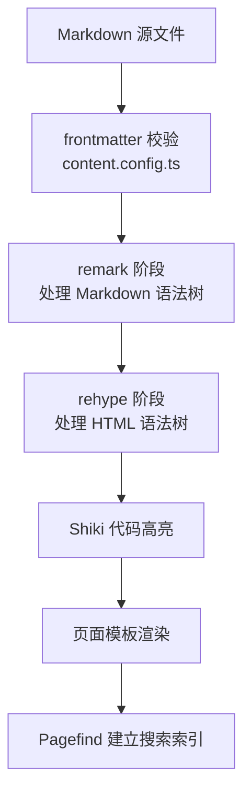
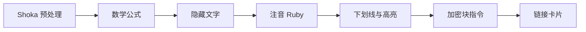
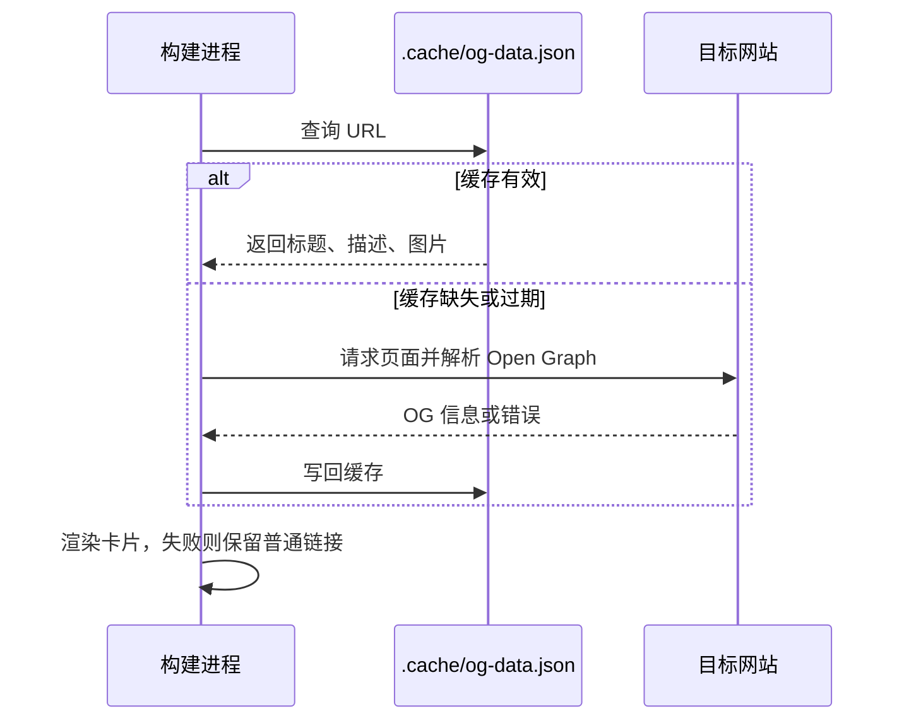
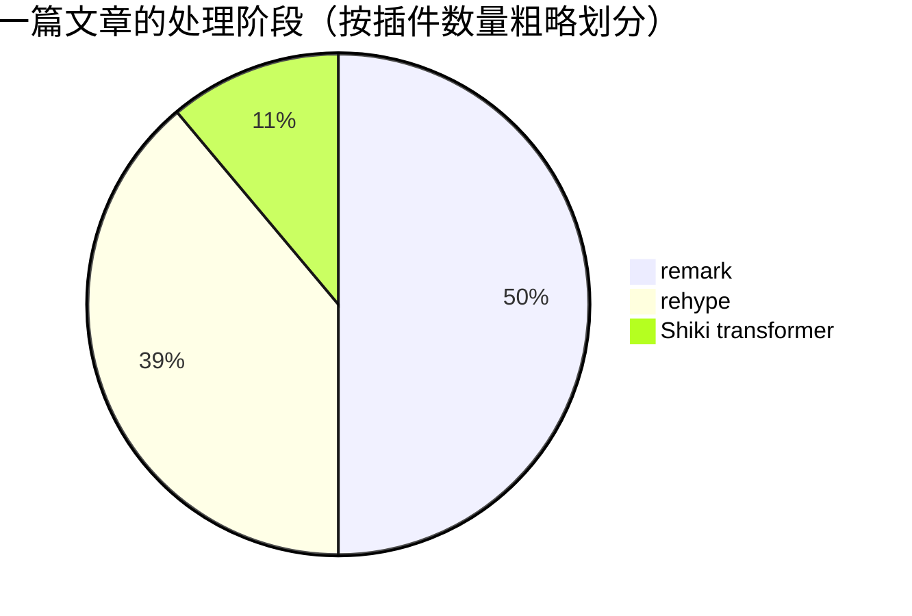

写主题文档时经常被问到：「为什么这个语法在加密块里也能用？」「链接卡片的数据是什么时候抓的？」答案都藏在构建顺序里。这篇用几张图把一篇 Markdown 文章从源文件到 HTML 的路径画出来。

:::info
本文由 AI 根据 `astro.config.mjs` 的插件注册顺序起草，我核对过顺序并删改了措辞。插件的增减以仓库当前代码为准。
:::

## 总览



frontmatter 先经过 Zod schema 校验。字段写错类型（比如把 `tags` 写成字符串）会在这一步直接报错，而不是渲染出奇怪的页面。

## remark 阶段

remark 处理的是 Markdown 语法树（mdast），这里的顺序有讲究：



- **Shoka 预处理必须第一个跑**。它会重新解析原始文本，修正 GFM 和 Shoka 语法之间的冲突。
- **数学公式要在注音、隐藏文字之前**，否则 `$a^b$` 里的 `^` 可能被当成注音语法。
- **链接卡片在最后**，这时段落结构已经稳定，只需要找出「单独成段的链接」。

### 链接卡片的数据从哪来



成功的结果默认缓存 30 天（`content.previewCacheTime`），失败的结果只缓存一天，方便下次构建重试。这个缓存文件是特意提交到 Git 的，CI 上构建时就不必重新抓取。

## rehype 阶段

rehype 处理 HTML 语法树（hast）：

1. 给标题生成 `id`，并附上锚点链接
2. 处理 Shoka 的花括号属性语法（给元素追加 class）
3. 给图片加上低质量占位图（LQIP）
4. 用 KaTeX 渲染公式
5. **最后**才是加密：整篇加密和 `:::encrypted` 块

加密放在最后，是因为它要加密的是已经完全渲染好的 HTML。这也回答了开头的问题：加密块里的代码高亮、公式、链接，在加密之前就已经处理完了。

## 代码块

代码块由 Shiki 在构建时高亮，所以页面上不需要加载任何高亮脚本。`title`、`mark`、`command` 这些元信息由一个 Shiki transformer 解析：

```js title="example.js" mark:2
const site = 'astro-koharu';
console.log(`Hello from ${site}`);
```

Mermaid 代码块被排除在 Shiki 之外，交给 Mermaid 单独渲染，本文的几张图就是这样来的。

## 小结



记住两条就够用：remark 管语法，rehype 管结构；加密永远在最后。
