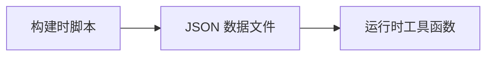

本文基本由 AI 制作，还处于 WIP 阶段，随时修改～

一份完整的 astro-koharu 博客系统使用指南，帮助你快速上手并充分利用所有功能特性。

https://github.com/cosZone/astro-koharu

## 快速开始

### 项目简介

astro-koharu 是一个基于 Astro 5.x 构建的现代化博客系统，从 Hexo 迁移而来，设计灵感和初衷都来自 [Shoka](https://github.com/amehime/hexo-theme-shoka) 主题。欢迎 [fork](https://github.com/cosZone/astro-koharu/fork) 出来制作自己的主题。

**核心特点：**

- 基于 Astro 5.x，静态站点生成，性能优异
- 优雅的深色/浅色主题切换
- 基于 Pagefind 的无后端全站搜索
- 完整的 Markdown 增强功能（GFM、代码高亮、自动目录）
- 灵活的多级分类与标签系统（从 Shoka 主题迁移，后续会考虑将其改为可关闭的）
- 特色周刊/系列文章支持
- 响应式设计
- 草稿与置顶功能
- 阅读进度条与阅读时间估算
- 移动端文章阅读头部
- 友链系统与归档页面
- RSS 订阅支持
- LQIP（低质量图片占位符）
- 圣诞特辑（可开关）

### 本地开发

```bash
# 克隆项目
git clone https://github.com/cosZone/astro-koharu.git
cd astro-koharu

# 安装依赖
pnpm install

# 启动开发服务器
pnpm dev

# 构建生产版本
pnpm build

# 预览生产构建
pnpm preview
```

### 快速部署

使用 Vercel 进行一键部署：

[](https://vercel.com/new/clone?repository-url=https://github.com/cosZone/astro-koharu&project-name=astro-koharu&repository-name=astro-koharu)

## 基本配置

### 站点配置

编辑 `src/constants/site-config.ts` 文件配置站点基本信息：

```typescript
export const siteConfig: SiteConfig = {
  title: '余弦の博客',           // 网站标题
  alternate: 'cosine',           // 英文短名（用作 logo 文本）
  subtitle: 'WA 的一声就哭了',   // 副标题
  name: 'cos',                   // 站点作者简称
  description: 'FE / ACG / ...',  // 站点简介
  avatar: '/img/avatar.webp',    // 头像路径
  showLogo: true,                // 是否显示 logo
  author: 'cos',                 // 文章作者
  site: 'https://blog.cosine.ren/', // 站点域名
  startYear: 2020,               // 站点创建年份
  keywords: ['cos', 'cosine', '博客', '前端'], // SEO 关键词
};
```

**特色分类配置：**

在首页底部展示的精选分类卡片：

```typescript
featuredCategories: [
  {
    link: 'life',              // 分类链接（对应 category_map）
    label: '随笔',             // 显示名称
    image: '/img/cover/2.webp', // 封面图片
    description: '生活记录、年度总结等', // 描述
  },
  // ... 更多分类
]
```

**周刊/系列配置：**

配置特色系列（如周刊）：

```typescript
featuredSeries: {
  categoryName: '周刊',        // 分类名称
  label: 'FE Bits',           // 显示标签
  fullName: 'FE Bits 前端周周谈', // 完整名称
  description: '...',         // 描述
  cover: '/img/weekly_header.webp', // 封面图
  enabled: true,              // 是否启用
  links: {                    // 相关链接
    github: 'https://github.com/...',
    rss: 'https://...',
    chrome: 'https://...',
  },
}
```

### 社交媒体配置

在 `src/constants/site-config.ts` 中配置社交媒体链接：

```typescript
export const socialConfig: SocialConfig = {
  github: {
    url: 'https://github.com/yusixian',
    icon: 'ri:github-fill',      // Iconify 图标名
    color: '#191717',            // 主题色
  },
  bilibili: {
    url: 'https://space.bilibili.com/10730895',
    icon: 'ri:bilibili-fill',
    color: '#da708a',
  },
  // ... 更多平台
};
```

支持的平台：GitHub, Twitter, Bilibili, 网易云音乐, Email, RSS 等。

### 导航配置

编辑 `src/constants/router.ts` 自定义导航菜单：

```typescript
export const routers: Router[] = [
  { name: '首页', path: Routes.Home, icon: 'fa6-solid:house-chimney' },
  { name: '周刊', path: Routes.Weekly, icon: 'ri:newspaper-line' },
  {
    name: '文章',
    icon: 'ri:quill-pen-ai-fill',
    children: [  // 支持嵌套子菜单
      { name: '分类', path: Routes.Categories, icon: 'ri:grid-fill' },
      { name: '标签', path: Routes.Tags, icon: 'fa6-solid:tags' },
      { name: '归档', path: Routes.Archives, icon: 'ri:archive-2-fill' },
    ],
  },
  { name: '友链', path: Routes.Friends, icon: 'ri:links-line' },
  { name: '关于', path: Routes.About, icon: 'fa6-regular:circle-user' },
];
```

### 分类映射配置

编辑 `_config.yml` 配置中文分类名到 URL slug 的映射：

```yaml
category_map:
  随笔: life
  笔记: note
  前端: front-end
  后端: back-end
  工具: tools
  周刊: weekly
  AI: ai
```

这样，"随笔" 分类的 URL 会是 `/categories/life`，而不是 `/categories/随笔`。

## 文章系统

### 创建文章

在 `src/content/blog/` 目录下创建 Markdown 文件。目录结构会影响文章的分类：

```plain
src/content/blog/
├── life/              # 随笔分类
│   └── 2024-life-review.md
├── note/
│   ├── front-end/     # 笔记 > 前端
│   │   └── react/
│   │       └── React学习小记.md
│   └── algorithm/     # 笔记 > 算法
│       └── 动态规划学习笔记.md
└── tools/             # 工具分类
    └── vscode插件推荐.md
```

### Frontmatter 字段说明

每篇文章开头需要包含 YAML frontmatter：

**必填字段：**

```yaml
---
title: 文章标题 # 必填
date: 2024-12-06 # 必填，发布日期
---
```

**常用可选字段：**

```yaml
---
title: 文章标题
date: 2024-12-06
updated: 2024-12-15 # 最近更新时间（可选，存在时会在文章页显示）
description: 文章摘要描述 # 用于 SEO 和列表展示，如不填写会自动使用 AI 摘要或提取正文前 150 字
link: custom-url-slug # 自定义 URL（默认使用文件名）
cover: /img/cover/1.webp # 封面图片
tags: # 标签列表
  - JavaScript
  - React
categories: # 分类（见下方详细说明）
  - 笔记
subtitle: 副标题 # 文章副标题
catalog: true # 是否显示目录（默认 true）
tocNumbering: true # 是否显示目录编号（默认 true）
draft: false # 是否为草稿（默认 false）
sticky: false # 是否置顶（默认 false）
---
```

**关于 description 字段：**

文章描述的优先级：手写 `description` > AI 自动摘要 > Markdown 正文前 150 字

- 建议为重要文章手写描述，以获得更好的 SEO 效果
- 如果省略描述，系统会自动使用 AI 生成的摘要（需运行 `pnpm generate:summaries`）
- 如果既没有手写描述也没有 AI 摘要，则自动提取文章正文的前 150 个字符

### 分类系统

astro-koharu 支持灵活的分类配置：

**单层分类：**

```yaml
categories:
  - 工具 # 或者 ['工具']
```

对应 URL: `/categories/tools`（根据 `_config.yml` 映射）

**多层嵌套分类：**

```yaml
categories:
  - [笔记, 前端, React]
```

这会创建层级关系：笔记 → 前端 → React

对应 URL: `/categories/note/front-end/react`

### 标签系统

标签是扁平的，不支持层级：

```yaml
tags:
  - JavaScript
  - TypeScript
  - 学习笔记
```

所有标签会在 `/tags` 页面展示，点击标签可查看该标签下的所有文章。

### 草稿功能

设置 `draft: true` 将文章标记为草稿：

```yaml
---
title: 未完成的文章
draft: true
---
```

**行为：**

- **本地开发** (`pnpm dev`)：草稿可见，文章卡片右上角显示 "DRAFT" 标识
- **生产构建** (`pnpm build`)：草稿自动过滤，不会出现在任何列表中

### 置顶功能

设置 `sticky: true` 将文章置顶：

```yaml
---
title: 重要公告
sticky: true
---
```

**行为：**

- 置顶文章显示在首页 "置顶文章" 区域
- 置顶文章按日期排序（最新的在前）
- 不影响其他页面（分类、标签、归档）的排序

### 周刊/系列文章

如果配置了 `featuredSeries`（见基本配置），该分类下的文章会：

1. 在首页置顶区域显示最新一篇
2. 拥有专属的周刊页面 (`/weekly`)
3. 不出现在普通文章列表中

**示例：**

```yaml
---
title: FE Bits Vol.16
categories:
  - 周刊 # 对应 featuredSeries.categoryName
---
```

## 界面功能

### 主题切换

点击右上角的太阳/月亮图标切换深色/浅色模式。

**代码高亮：**

- 浅色模式：`github-light`
- 深色模式：`github-dark`

### 全站搜索

基于 [Pagefind](https://pagefind.app/) 的静态站点搜索，无需后端服务器。

**打开搜索：**

- 点击导航栏搜索图标
- 快捷键：`Cmd/Ctrl + K`

**特性：**

- 支持中文分词
- 实时搜索结果
- 高亮匹配关键词
- 显示文章摘要和元信息

### 文章阅读功能

**目录导航 (Table of Contents)：**

- 自动提取文章标题（h2-h6）生成目录
- 使用 CSS 计数器自动为标题添加层级编号（如 1., 1.1., 1.1.1.）
- 支持通过 frontmatter 的 `tocNumbering: false` 字段关闭编号显示
- 点击目录项跳转到对应章节
- 滚动时自动高亮当前章节
- 桌面端显示在右侧边栏，移动端折叠

**目录编号控制：**

```yaml
---
title: 我的文章
tocNumbering: false # 关闭目录编号（默认为 true）
---
```

- 默认情况下，所有文章的目录都会显示层级编号
- 设置 `tocNumbering: false` 可以关闭特定文章的编号显示
- 编号通过 CSS 计数器实现，零运行时开销
- 同时适用于桌面端侧边栏和移动端下拉目录

**阅读进度条：**

- 页面顶部显示阅读进度
- 实时更新当前阅读位置

**标题锚点链接：**

- 每个标题自动生成 ID
- 悬停标题时显示 `#` 链接图标
- 点击可复制带锚点的 URL

**系列文章导航：**

文章底部显示同系列的上一篇/下一篇：

- 基于最深层分类自动分组
- 按发布日期排序
- 显示文章标题和封面

**阅读时间估算：**

文章卡片显示预计阅读时间（基于字数计算）。

**移动端文章阅读头部：**

在移动端（≤992px）浏览文章时，顶部导航栏会显示专为阅读优化的头部：

- **圆形阅读进度** - 实时显示当前阅读进度的圆形进度条
- **当前章节标题** - 显示当前所在的 H2/H3 章节标题，切换时带有平滑动画
- **可展开目录** - 点击标题区域可展开完整的文章目录，快速跳转到任意章节

特性：

- 滚动时自动更新当前章节
- 支持 `prefers-reduced-motion` 减少动画

### 响应式设计

**桌面端：**

- 双栏布局（主内容 + 侧边栏）
- 固定导航栏
- 悬浮目录

**平板：**

- 自适应布局调整
- 简化侧边栏

**移动端：**

- 单栏布局
- 抽屉式导航菜单（汉堡菜单）
- 折叠式目录
- 触摸优化的交互
- 文章页专属阅读头部（进度圈 + 当前标题 + 可展开目录）

## 特色功能

### 周刊系统

如果启用了 `featuredSeries`，会自动生成周刊相关功能：

**专属周刊页面** (`/weekly`)：

- 显示所有周刊文章
- 周刊头图和介绍
- 相关链接（GitHub, RSS 等）

**首页展示：**

- 最新周刊文章置顶显示
- 独立于普通文章列表

### 归档页面

访问 `/archives` 查看所有文章的归档视图：

- 按年份分组
- 显示每年的文章数量
- 时间线式展示
- 包含文章发布日期、标题、分类

### 友链系统

访问 `/friends` 查看友情链接页面：

**功能：**

- 友链卡片展示
- 友链申请表单（可自定义）
- 支持头像、名称、描述、链接

### LQIP（低质量图片占位符）

LQIP（Low Quality Image Placeholder）是一种图片加载优化技术，在高清图片加载完成前，先显示一个低质量的占位符，避免页面出现空白或布局抖动。

**特性：**

- 🎨 构建时自动提取图片主色调，生成 CSS 渐变占位符
- ⚡ 零运行时开销 —— 纯 CSS 实现，无需 JavaScript 解码
- 📦 极小数据体积 —— 每张图片仅需 18 字符存储
- 🔄 外部图片自动降级为纯色占位符

**支持的组件：**

- 文章卡片封面 (`PostItemCard`)
- 页面横幅 (`Cover`)
- 分类卡片背景 (`CategoryCards`)
- 周刊封面 (`WeeklyCover`)
- 侧边栏头像 (`HomeInfo`)

**使用方式：**

```bash
# 生成 LQIP 数据（处理 public/img/ 下所有图片）
pnpm generate:lqips
```

**生成效果：**

LQIP 数据保存在 `src/assets/lqips.json`，格式如下：

```json
{
  "cover/1.webp": "87a3c4c2dfefbddae9",
  "cover/2.webp": "6e3b38ae7472af7574"
}
```

每个值是 18 个十六进制字符（3 个颜色），运行时解码为 CSS 渐变：

```css
linear-gradient(135deg, #87a3c4 0%, #c2dfef 50%, #bddae9 100%)
```

**原理：**

1. 使用 sharp 将图片缩放到 2×2 像素
2. 提取四象限的平均色（左上、右上、左下、右下）
3. 选取 3 个颜色生成 135 度斜向渐变
4. 存储为紧凑的十六进制字符串

**在组件中使用：**

```astro
---
import { getLqipStyle, getLqipProps } from '@lib/lqip';

// 方式 1：直接获取样式字符串
const style = getLqipStyle('/img/cover/1.webp');
// 返回: "background-image:linear-gradient(...)"

// 方式 2：获取完整的 props（支持外部图片降级）
const lqipProps = getLqipProps(coverUrl);
// 本地图片返回: { style: "background-image:..." }
// 外部图片返回: { class: "lqip-fallback" }
---

<div style={style}>
  
</div>
```

**注意事项：**

- 生成的 `src/assets/lqips.json` 需要提交到 git
- 添加新图片后需要重新运行 `pnpm generate:lqips`
- 外部图片（http/https 开头）会自动使用纯色占位符降级

### 相关文章推荐

参考 [No Server, No Database: Smarter Related Posts in Astro with `transformers.js`](https://alexop.dev/posts/semantic-related-posts-astro-transformersjs/)

基于语义相似度的智能文章推荐系统，使用 [transformers.js](https://huggingface.co/docs/transformers.js) 在本地生成文章嵌入向量，计算文章间的语义相似度。

**特性：**

- 🧠 基于 AI 嵌入模型（Snowflake Arctic Embed）的语义理解
- 📊 自动计算文章间的相似度，推荐最相关的 5 篇文章
- 🚀 构建时预计算，运行时零开销
- 🔧 支持排除特定文章（如周刊）

**使用方式：**

```bash
# 生成相似度数据（本地运行，会自动下载模型，约需 3-5 分钟）
pnpm generate:similarities

# 生成的文件会提交到 git，Vercel 等平台直接使用
```

**配置排除规则：**

编辑 `src/scripts/generateSimilarities.ts` 中的 `EXCLUDE_PATTERNS`：

```typescript
const EXCLUDE_PATTERNS = [
  'weekly-', // 排除周刊文章
];
```

**配置计算内容：**

可以选择是否将文章正文纳入相似度计算：

```typescript
// true: 使用 标题 + 描述 + 正文（更准确，速度较慢）
// false: 仅使用 标题 + 描述（更快，适合文章数量较多的情况）
const INCLUDE_BODY = true;
```

- **包含正文**：相似度更精确，能识别内容层面的相关性，但生成速度较慢
- **仅标题+描述**：生成速度快，适合描述写得比较详细的博客

```bash
# 使用 Snowflake/snowflake-arctic-embed-m-v2.0 计算 168 篇文章（标题+描述）的时间
Done! Generated similarities for 168 posts in 4.1s

# 使用 Snowflake/snowflake-arctic-embed-m-v2.0 计算 168 篇文章（标题+描述+正文）的时间
Done! Generated similarities for 168 posts in 219.3s
```

这差别有点大，但是我个人很喜欢带正文的结果，效果显然会更好。所以索性再加一个跑 AI 总结的功能。

**模型选择：**

默认使用 `Snowflake/snowflake-arctic-embed-m-v2.0` 模型：

- **模型大小**：约 90MB（首次运行会自动下载到 `.cache/transformers` 目录）
- **向量维度**：768 维
- **性能**：平衡了质量和速度，适合中文和英文内容
- **生成时间**：约 3-5 分钟（169 篇文章）

如需更换模型，编辑 `src/scripts/generateSimilarities.ts` 中的 `MODEL_NAME`：

```typescript
const MODEL_NAME = 'Snowflake/snowflake-arctic-embed-m-v2.0';
// 可选替代方案：
// const MODEL_NAME = 'sentence-transformers/all-MiniLM-L6-v2'; // 更小更快（约 23MB），384 维
// const MODEL_NAME = 'BAAI/bge-small-zh-v1.5';  // 针对中文优化
```

**其他可选模型对比：**

| 模型                                      | 大小  | 维度 | 优势               |
| ----------------------------------------- | ----- | ---- | ------------------ |
| `Snowflake/snowflake-arctic-embed-m-v2.0` | ~90MB | 768  | 质量高，中英文均衡 |
| `sentence-transformers/all-MiniLM-L6-v2`  | ~23MB | 384  | 轻量快速           |
| `BAAI/bge-small-zh-v1.5`                  | ~95MB | 512  | 中文专用           |

**注意事项：**

- 需要本地运行生成脚本（Vercel 等平台无法运行模型）
- 生成的 `src/assets/similarities.json` 需要提交到 git
- 如果没有生成相似度文件，相关文章模块不会显示
- 模型文件会缓存在 `.cache/transformers` 目录（已添加到 `.gitignore`）

### AI 自动摘要

基于 [transformers.js](https://huggingface.co/docs/transformers.js) 的智能摘要生成系统，使用先进的 AI 模型为文章自动生成高质量摘要。

**与相关文章推荐的关系：**

AI 摘要功能与相关文章推荐功能相辅相成：

- **相似度计算**需要读取文章全文，计算成本较高（约 3-5 分钟）
- **AI 摘要**可以在不读取全文的情况下提供优质描述，同时生成的摘要也能帮助改善相似度计算的效果
- 两者共享相同的模型缓存机制，节省存储空间

**特性：**

- 🤖 基于先进的文本生成模型（Xenova/LaMini-Flan-T5-783M）
- 📝 自动为缺少描述的文章生成摘要
- ✨ 文章详情页支持打字机动画展示，增强阅读体验
- 🎯 智能 fallback：优先使用手写 description，无描述时自动使用 AI 摘要
- 🚀 构建时预生成，运行时零开销
- ♿ 支持无障碍访问和 prefers-reduced-motion

**使用方式：**

```bash
# 生成 AI 摘要（本地运行，首次会下载模型，约需 5-10 分钟）
pnpm generate:summaries

# 生成的文件要提交到 git，然后可以在 Vercel 等平台直接使用
```

**生成效果：**

AI 摘要会保存在 `src/assets/summaries.json` 文件中，格式如下：

```json
{
  "article-slug": {
    "title": "文章标题",
    "summary": "AI 生成的摘要内容..."
  }
}
```

**在哪里使用：**

1. **文章详情页**：面包屑导航下方显示可折叠的 AI 摘要卡片
   - 默认收起状态，点击"展开"按钮触发
   - 展开后以打字机动画逐字显示摘要内容
   - 打字机动画仅播放一次，支持 `prefers-reduced-motion` 用户偏好

2. **文章卡片**：作为描述的 fallback
   - 优先级：手写 `description` > AI 摘要 > Markdown 前 150 字
   - 在文章列表、首页、分类页等处自动使用

**模型选择：**

默认使用 `Xenova/LaMini-Flan-T5-783M` 模型：

- **模型大小**：约 300MB（首次运行会自动下载到 `.cache/transformers` 目录）
- **生成质量**：高质量的中英文摘要生成
- **生成时间**：约 5-10 分钟（169 篇文章）

如需更换模型，编辑 `src/scripts/generateSummaries.ts` 中的 `MODEL_NAME`：

```typescript
const MODEL_NAME = 'Xenova/LaMini-Flan-T5-783M';
// 可选替代方案：
// const MODEL_NAME = 'Xenova/distilbart-cnn-6-6'; // 更快，英文效果好
// const MODEL_NAME = 'facebook/bart-large-cnn';   // 质量更高，但速度较慢
```

**配置提示词：**

可以自定义生成摘要的提示词，编辑 `src/scripts/generateSummaries.ts` 中的 `PROMPT_TEMPLATE`：

```typescript
const PROMPT_TEMPLATE = (title: string, content: string) =>
  `请为以下文章生成一段简洁的摘要（100-150字）：\n\n标题：${title}\n\n内容：${content}`;
```

**注意事项：**

- 需要本地运行生成脚本（Vercel 等平台无法运行大模型）
- 生成的 `src/assets/summaries.json` 需要提交到 git
- 如果没有生成摘要文件，会自动 fallback 到 Markdown 文本提取
- 模型文件会缓存在 `.cache/transformers` 目录（已添加到 `.gitignore`）
- 首次运行需要下载模型，建议在网络良好的环境下进行

**最佳实践：**

1. **与相似度计算配合使用**：

   ```bash
   # 先生成摘要
   pnpm generate:summaries
   # 再计算相似度（可以使用摘要代替全文，提升速度）
   pnpm generate:similarities
   ```

2. **选择性生成摘要**：为了节省时间，脚本会跳过已有 `description` 的文章

3. **提交到版本控制**：将生成的 JSON 文件提交到 git，避免在 CI/CD 环境重复生成

### 圣诞特辑

节日限定的圣诞氛围特效系统，包含多种可独立开关的视觉效果，为博客增添节日气氛。

**特性：**

- 雪花飘落 —— Canvas 实现的雪花动画，分前景和背景两层，支持视差效果
- 圣诞配色 —— 红绿金主题色替换默认粉蓝配色，支持深色/浅色模式
- 圣诞帽装饰 —— 侧边栏头像上的圣诞帽
- 圣诞灯串 —— Header 顶部的装饰灯串动画
- 圣诞饰品切换 —— 导航栏的装饰饰品
- 运行时开关 —— 右下角浮动按钮可随时切换特效，设置自动保存

**配置方式：**

编辑 `src/constants/site-config.ts` 中的 `christmasConfig`：

```typescript
export const christmasConfig: ChristmasConfig = {
  enabled: true,           // 总开关
  features: {
    snowfall: true,        // 雪花飘落
    christmasColorScheme: true,  // 圣诞配色
    christmasCoverDecoration: true,  // 灯串装饰
    christmasHat: true,    // 圣诞帽
  },
  snowfall: {
    speed: 1,              // 飘落速度（默认 1）
    intensity: 0.6,        // 桌面端雪花密度（0-1）
    mobileIntensity: 0.4,  // 移动端雪花密度（0-1）
  },
};
```

**用户控制：**

- 页面右下角悬浮按钮（雪花图标）可切换圣诞特效开关
- 用户偏好自动保存到 localStorage，跨会话保持
- 支持 `prefers-reduced-motion` 偏好，自动禁用动画

**技术实现：**

- 雪花使用 Canvas 2D 渲染，分层实现视差效果
- 配色通过 CSS 变量覆盖，零运行时开销
- 状态管理使用 nanostores，支持跨组件同步
- 完全响应式，移动端自动降低雪花密度

**关闭圣诞特效：**

设置 `christmasConfig.enabled = false` 即可完全关闭所有圣诞特效。

### 站点公告系统

无后端的站点公告系统，支持在配置文件中管理公告，首次访问自动弹出，关闭后可通过页脚入口再次查看。

**特性：**

- 无后端 —— 公告内容写在配置文件，无需数据库
- Toast 通知 —— 右下角浮动通知，支持多条堆叠显示
- 多条公告 —— 支持配置多条公告，按优先级排序
- 时间控制 —— 支持设置公告的开始/结束日期，自动控制显示
- 自定义颜色 —— 每条公告可设置独立颜色，覆盖默认类型颜色
- 时间线弹窗 —— 公告列表采用时间线样式，带渐变连接线
- Hover 已读 —— 悬停 Toast 1 秒后自动标记已读
- 已读追踪 —— localStorage 记录已读状态，返回访问不重复弹出
- 再次查看 —— 页脚入口可随时查看所有公告，带未读红点提示

**配置方式：**

编辑 `src/constants/announcements.ts` 添加公告：

```typescript
import type { Announcement } from '@/types/announcement';

export const announcements: Announcement[] = [
  {
    id: 'welcome-2026',           // 唯一标识
    title: '2026 年新年快乐!',      // 公告标题
    content: '新年快乐! 感谢大家一直以来的支持~',  // 公告内容
    type: 'success',              // 类型：info | warning | success | important
    priority: 10,                 // 优先级（越高越先显示）
    color: '#FF6B6B',             // 自定义颜色（可选，覆盖 type 默认色）
    publishDate: '2026-01-01',    // 显示日期（可选，用于时间线展示）
    startDate: '2025-12-31T00:00:00+08:00',  // 开始日期（可选）
    endDate: '2026-01-15T23:59:59+08:00',    // 结束日期（可选）
    link: {                       // 链接（可选）
      url: 'https://example.com',
      text: '了解更多',
      external: true,
    },
  },
];
```

**公告类型样式：**

| 类型        | 说明     | 默认颜色 |
| ----------- | -------- | -------- |
| `info`      | 信息通知 | 蓝色 (#3b82f6) |
| `warning`   | 警告提示 | 黄色 (#eab308) |
| `success`   | 成功消息 | 绿色 (#22c55e) |
| `important` | 重要公告 | 红色 (#ef4444) |

> 设置 `color` 字段可覆盖上述默认颜色

**交互流程：**

1. **首次访问**：0.5 秒后自动弹出未读公告 Toast（多条堆叠显示）
2. **Hover 已读**：悬停在 Toast 上 1 秒后自动标记已读
3. **手动关闭**：点击 Dismiss 关闭 Toast
4. **点击"View all"**：关闭所有 Toast，打开时间线弹窗
5. **时间线弹窗**：点击公告卡片标记已读，显示发布日期和渐变连接线
6. **页脚入口**：随时可点击查看所有公告，未读时显示红点
7. **返回访问**：只显示真正未读的公告

**注意事项：**

- 公告 `id` 必须唯一，用于追踪已读状态
- 省略 `startDate` 表示立即生效，省略 `endDate` 表示永不过期
- `publishDate` 用于时间线弹窗中的日期显示，省略时使用 `startDate`
- 过期公告建议从配置中删除，保持配置简洁
- 已读状态存储在 localStorage，key 为 `announcement-read-ids`

### Markdown 增强

**语法支持：**

- GitHub Flavored Markdown (GFM)
  - 表格
  - 任务列表
  - 删除线
  - 自动链接

**Mermaid 图表：**

支持在 Markdown 中使用 Mermaid 语法绘制流程图、时序图、架构图等。

````markdown

````


支持的图表类型：

- `flowchart` / `graph` - 流程图
- `sequenceDiagram` - 时序图
- `classDiagram` - 类图
- `stateDiagram` - 状态图
- `erDiagram` - ER 图
- `gantt` - 甘特图
- `pie` - 饼图
- `mindmap` - 思维导图

图表会自动跟随深色/浅色主题切换。更多语法参考 [Mermaid 官方文档](https://mermaid.js.org/)。

**代码高亮：**

- 基于 Shiki
- 支持双主题（深色/浅色）
- 支持语言标注
- 行号显示

示例：

````markdown
```javascript
function hello() {
  console.log('Hello, world!');
}
```
````

```javascript
function hello() {
  console.log('Hello, world!');
}
```

**标题自动链接：**

所有标题自动生成可点击的锚点链接。

**链接自动嵌入：**

独行的特殊链接会自动转换为嵌入组件：

- **Twitter/X 链接**：自动嵌入 Tweet 组件
- **CodePen 链接**：自动嵌入交互式 CodePen 演示
- **其他链接**：显示 OG 预览卡片（包含标题、描述、图片等）

示例：

```markdown
<!-- 独行链接会被嵌入 -->

https://x.com/vercel_dev/status/1997059920936775706

https://codepen.io/botteu/pen/YPKBrJX/

https://github.com/vercel/react-tweet

反爬严格，获取不到元信息的链接

https://zhuanlan.zhihu.com/p/1900483903984243480

<!-- 段落中的链接保持不变 -->

这是一个 [普通链接](https://example.com)，不会被嵌入。
```

https://x.com/vercel_dev/status/1997059920936775706

https://codepen.io/botteu/pen/YPKBrJX/

https://github.com/vercel/react-tweet

反爬严格，获取不到元信息的链接

https://zhuanlan.zhihu.com/p/1900483903984243480

<!-- 段落中的链接保持不变 -->

这是一个 [普通链接](https://example.com)，不会被嵌入。

**其他增强：**

- 自动目录生成
- 阅读时间计算
- 外部链接自动添加 `target="_blank"`

### RSS 订阅

访问 `/rss.xml` 获取 RSS feed。

**包含内容：**

- 最新文章列表
- 文章摘要
- 发布日期
- 文章链接

### 数据统计

集成 Umami 分析（可选）。

在 `astro.config.mjs` 中配置：

```javascript
umami({
  id: 'your-website-id',
  endpointUrl: 'https://stats.example.com',
  hostUrl: 'https://stats.example.com',
});
```

## 开发指南

### 目录结构

```plain
astro-koharu/
├── src/
│   ├── components/      # 组件
│   │   ├── common/      # 通用组件（错误边界等）
│   │   ├── ui/          # UI 组件（按钮、卡片等）
│   │   ├── layout/      # 布局组件（头部、侧边栏等）
│   │   ├── post/        # 文章相关组件
│   │   ├── category/    # 分类组件
│   │   └── theme/       # 主题切换
│   ├── content/
│   │   └── blog/        # 博客文章（Markdown）
│   ├── layouts/         # 页面布局模板
│   ├── pages/           # 页面路由
│   ├── lib/             # 工具函数
│   ├── hooks/           # React hooks
│   ├── constants/       # 常量配置
│   ├── scripts/         # 构建脚本
│   ├── styles/          # 全局样式
│   └── types/           # TypeScript 类型定义
├── public/              # 静态资源
│   └── img/             # 图片资源
├── _config.yml          # 分类映射配置
├── astro.config.mjs     # Astro 配置
├── tailwind.config.ts   # Tailwind 配置
└── tsconfig.json        # TypeScript 配置
```

### 路径别名

项目配置了以下路径别名（在 `tsconfig.json` 中）：

```typescript
import { something } from '@/xxx';           // → src/xxx
import Component from '@components/xxx';     // → src/components/xxx
import { util } from '@lib/xxx';            // → src/lib/xxx
import config from '@constants/xxx';        // → src/constants/xxx
// ... 更多别名见 tsconfig.json
```

### 常用命令

```bash
# 开发
pnpm dev              # 启动开发服务器（默认 localhost:4321）

# 构建
pnpm build            # 构建生产版本
pnpm preview          # 预览生产构建

# 代码质量
pnpm lint             # 运行 ESLint
pnpm lint-md          # 检查 Markdown 文件
pnpm lint-md:fix      # 自动修复 Markdown 问题
pnpm knip             # 查找未使用的文件和依赖

# AI 功能
pnpm generate:summaries      # 生成文章 AI 摘要
pnpm generate:similarities   # 生成文章相似度数据

# 图片优化
pnpm generate:lqips          # 生成图片 LQIP 占位符数据

# 工具
pnpm change           # 生成 CHANGELOG.md（基于 git-cliff）
```

### 如何添加新页面

1. 在 `src/pages/` 目录创建 `.astro` 文件
2. Astro 使用文件系统路由，文件路径即 URL 路径

示例：

```plain
src/pages/about.astro       → /about
src/pages/tags/[tag].astro  → /tags/:tag（动态路由）
```

### 如何自定义样式

**全局样式：**

编辑 `src/styles/index.css`。

**组件样式：**

使用 Tailwind CSS 工具类或 Astro 的 `<style>` 标签。

**Tailwind 配置：**

编辑 `tailwind.config.ts` 自定义主题、颜色、字体等。

**主题变量：**

在 `src/styles/index.css` 中定义的 CSS 变量：

```css
:root {
  --primary-color: #ff6b6b;
  /* ... 更多变量 */
}
```

### 动画系统

使用 CSS 动画以及 [Motion](https://motion.dev/)。

**动画配置：**

在 `src/constants/anim/` 目录中：

- `spring.ts` - 弹簧动画配置
- `variants.ts` - 动画变体定义
- `props.ts` - 可复用的动画属性

**使用示例：**

```tsx
import { motion } from 'motion/react';
import { fadeIn } from '@constants/anim/variants';

<motion.div variants={fadeIn} initial="hidden" animate="visible">
  内容
</motion.div>
```

## 与 Hexo/Shoka 主题的对比

### 保留的特性

- ✅ 分类和标签系统
- ✅ 文章置顶功能
- ✅ 深色/浅色主题切换
- ✅ 响应式设计
- ✅ 友链页面
- ✅ 归档页面

### 改进之处

**性能：**

- ⚡ 静态站点生成 (SSG)，加载速度更快
- ⚡ 按需加载 JavaScript
- ⚡ 图片优化

**开发体验：**

- 🛠️ TypeScript 类型安全
- 🛠️ 热模块替换 (HMR)
- 🛠️ 现代化的开发工具链

**功能增强：**

- 🔍 更强大的全站搜索（Pagefind）
- 📝 内容集合 (Content Collections) 类型安全
- 🎨 Tailwind CSS 4.x 样式系统
- 🌊 View Transitions API 页面过渡

### 技术栈差异

| 方面     | Hexo + Shoka   | astro-koharu        |
| -------- | -------------- | ------------------- |
| 框架     | Hexo (Node.js) | Astro 5.x           |
| 模板引擎 | EJS/Pug        | Astro + React       |
| 样式     | Stylus         | Tailwind CSS 4.x    |
| 构建工具 | Webpack        | Vite                |
| 类型检查 | 无             | TypeScript          |
| 内容管理 | 文件系统       | Content Collections |

## 常见问题

### 如何修改封面图片？

在文章 frontmatter 中设置 `cover` 字段：

```yaml
cover: /img/cover/1.webp
```

图片放在 `public/img/` 目录。如果不设置，会使用默认封面。

### 如何自定义域名？

部署到 Vercel 后，在 Vercel 项目设置中添加自定义域名，然后更新 `src/constants/site-config.ts` 中的 `site` 字段。

### 如何添加评论功能？

项目预留了评论组件位置（`src/components/comment/`），你可以集成 Giscus、Waline 等评论系统。

### 草稿文章如何预览？

运行 `pnpm dev` 本地开发模式，草稿会自动显示（带 DRAFT 标识）。

### 如何关闭某些功能？

- **关闭周刊**：设置 `featuredSeries.enabled = false`
- **关闭搜索**：移除 `astro.config.mjs` 中的 `pagefind()` 集成
- **关闭统计**：移除 `umami()` 集成

### 如何更改文章 URL 格式？

默认使用文件名作为 URL。可以通过 `link` 字段自定义：

```yaml
link: my-custom-url
```

## 参考资源

- [Astro 官方文档](https://docs.astro.build/)
- [Tailwind CSS 文档](https://tailwindcss.com/docs)
- [Motion 文档](https://motion.dev/docs)
- [Pagefind 文档](https://pagefind.app/)
- [Shoka 主题文档](https://shoka.lostyu.me/computer-science/note/theme-shoka-doc/)

## 更新日志

查看 [CHANGELOG.md](https://github.com/cosZone/astro-koharu/blob/main/CHANGELOG.md) 了解版本更新历史。

---

如有问题或建议，欢迎在 [GitHub Issues](https://github.com/cosZone/astro-koharu/issues) 中反馈。
